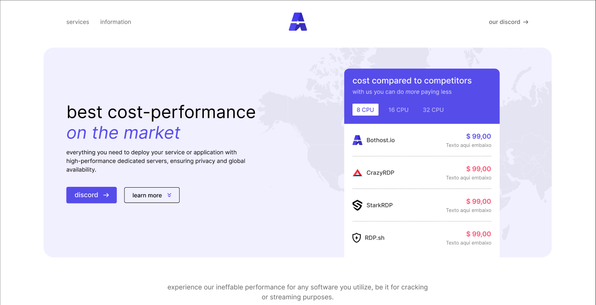

  <h1 align="center"> bothost.io v2 </h1>

practicing html + css on bothost re-design

  <a href="https://8ceb6d2e.bothost.pages.dev/">bothost v1</a>&nbsp;&nbsp;&nbsp;|&nbsp;&nbsp;&nbsp;
  <a href="https://v2.bothost.pages.dev/">bothost v2</a>&nbsp;&nbsp;&nbsp;&nbsp;&nbsp;&nbsp;

 

  <a href="https://v2.bothost.pages.dev/" target="_blank">
    
  </a

